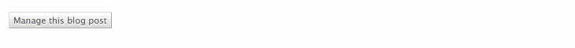

.. links go here
.. _Twitter Bootstrap: http://twitter.github.com/bootstrap/
.. _django-sekizai: http://django-sekizai.readthedocs.org/
.. _django-compressor: http://django_compressor.readthedocs.org/
.. _jQuery: http://jquery.com/
.. _jQuery ajaxForm: http://www.malsup.com/jquery/form/

Optional, replaceable extras
============================

In the :doc:`installation and basic usage <getting_started>` we covered the
bare minimum required to display plain text links to the admin. We can, of
course, do better than that, and django-adminlinks comes with a few bits and
pieces to do so. None of them are required, or even enabled by default, and all
of them are replaceable.

Styling the links
-----------------

If you're lucky, they'll already look as nice as your regular links, because
that's all they are. Don't believe me? Here's the default template for the edit
link:

.. literalinclude:: ../adminlinks/templates/adminlinks/edit_link.html
    :language: django

As you can see, the links can be styled in a composite way because they have
multiple classes.

.. _bundled_css:

Using the provided styles
^^^^^^^^^^^^^^^^^^^^^^^^^

There's a template tag we've not mentioned until now, because it's probably not
suitable for use with things like `django-sekizai`_ or `django-compressor`_.

Behold ``render_adminlinks_css``::

    
    <!doctype html>
    <html>
        <head>
            
        </head>
        <body>
            [...]
        </body>
    </html>

That's all there is to it. Infact, it's not even a complex tag, it just handles
rendering this on your behalf and does so if the ``request.user`` can
potentially use the `AdminSite`:

.. literalinclude:: ../adminlinks/templates/adminlinks/css.html
    :language: django

The styles in ``widgets.css`` are designed to emulate the visuals of the
default Django admin, without using any images. You can override them by
providing your own ``widgets.css``, or override the
``adminlinks/templates/adminlinks/css.html`` file in your own templates,
wherever you've specified them under ``TEMPLATE_DIRS``.

As you can see, the ```` also renders another
stylesheet, ``fancyiframe-custom.css``, which is used in conjunction with the
:ref:`provided JavaScript <bundled_js>`.

Including the CSS should get you links like this GIF, which is just the output
of::

    
    

.. _preview_buttons:

.. note::
    If you're using either `django-sekizai`_ or `django-compressor`_,
    you'll need to handle whether or not the stylesheets should be displayed
    yourself. The simplest test would be something like
    ````.
    Or you can just always include them, I suppose.

Making things modal
-------------------

Though it is inevitably not perfect, we can make the UX a little better by
allowing users to edit things *in-place*, via the included modal iframe.

.. _bundled_js:

Using the provided JavaScript
^^^^^^^^^^^^^^^^^^^^^^^^^^^^^

Exactly like the  :ref:`bundled Stylesheets template tag <bundled_css>`,
there's a template tag for rendering the bundled JavaScript. The same caveats
about `django-sekizai`_ and `django-compressor`_ apply::

    
    <!doctype html>
    <html>
        <head>
            [...]
        </head>
        <body>
        [...]
            
        </body>
    </html>

Which will output:

.. literalinclude:: ../adminlinks/templates/adminlinks/js.html

As you can see, the JavaScript is a little bit more involved. It uses the
`jQuery`_ which comes with Django, and a script of my own wrangling, to display
an ``<iframe>`` in a modal box. It hooks up all classes of
``django-adminlinks--btn`` to this modal box -- this CSS class is applied as a
namespace to all the links.

Patching the standard ModelAdmin
--------------------------------

If you're making use of the :ref:`bundled JavaScript <bundled_js>`, through the
template tag or otherwise, you'll probably want to alter the behaviour of the
Django ModelAdmin instances in an effort to better support the modal-editing.
We can extend the behaviour like so:

.. literalinclude:: _admin_mixin.py
    :language: python
    :lines: 1-8

Or, for the slightly more complex usage of replacing a third-party admin:

.. literalinclude:: _admin_mixin.py
    :language: python
    :lines: 12-26

For more complex admins, or different ways of handling displaying things (such
as using `jQuery ajaxForm`_, or one of the many other modal boxes) you'll have
to go off the beaten track and drop some/most of the provided stuff. Any
suggestions for how to make it more flexible, do :ref:`get in contact
<contributing>` and explain.

Editing field subsets
^^^^^^^^^^^^^^^^^^^^^

If your intention is to use the **edit field** template tag::

    

You'll need to amend your :class:`~django.contrib.admin.ModelAdmin` to support
the dynamic generation of that form, using the
:class:`~adminlinks.admin.AdminlinksMixin`, which updates the
standard :meth:`~django.contrib.admin.ModelAdmin.get_urls`
to expose the :meth:`~adminlinks.admin.AdminlinksMixin.change_field_view`

Success responses
^^^^^^^^^^^^^^^^^

To allow our :ref:`bundled JavaScript's modal box <bundled_js>` to automatically
close after a non-idempotent action (eg: add/change/delete), we need to override
the existing modeladmin methods
:meth:`~django.contrib.admin.ModelAdmin.response_add`,
:meth:`~django.contrib.admin.ModelAdmin.response_change` and
:meth:`~django.contrib.admin.ModelAdmin.delete_view` to handle sending a message
to the modal window. That too is covered by including
:class:`~adminlinks.admin.AdminlinksMixin`.

Simplifying the :class:`~django.contrib.admin.AdminSite` visual clutter
-----------------------------------------------------------------------

If you're aiming for doing *everything* via the front-end, using the template
tags to their fullest potential, you may want to get rid of some of the visual
noise the admin provides (header, breadcrumbs, *etc*). Add the following to
your ``TEMPLATE_CONTEXT_PROCESSORS`` to make it behave as if it were in a
popup, reducing the visual context appropriately::

    TEMPLATE_CONTEXT_PROCESSORS = (

        # These are other context processors we probably already have ...
        "django.contrib.auth.context_processors.auth",
        "django.core.context_processors.media",
        "django.core.context_processors.static",
        "django.core.context_processors.request",

        # This is our new context processor!
        "adminlinks.context_processors.fix_admin_popups",
    )

See :func:`~adminlinks.context_processors.fix_admin_popups` for more.
