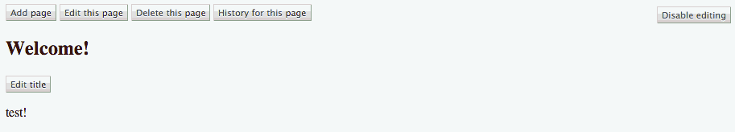

.. django-adminlinks documentation master file,
    created by sphinx-quickstart on Thu Sep 6 20:10:58 2012.

django-adminlinks
=================

Usage documentation
-------------------

.. toctree::
    :maxdepth: 5

    getting_started
    extras

What it is
----------

A suite of template tags for rendering links to a Django
:class:`~django.contrib.admin.AdminSite` instance.

At it's most basic, given a :class:`~django.db.models.Model`, it will do the
appropriate checks to ensure that the currently signed in user can perform the
requested action via the admin, and displays a configurable template with a link
to the right place.

Why?
----

Because I wedge the Django admin into everything, whether it should fit or not.
Not so much because I love the admin, but because it provides a well-understood
CRUD application that can be bolted onto in a pinch.

Features
--------

Here's a brief run-down on what's in the box:

* Basic, sane permission checking

  * Calling the template tags without a RequestContext should not expose any
    markup.
  * Users must be signed in, and pass the permission checking for
    the specific administration view.

* Optional :ref:`CSS <bundled_css>` and :ref:`JavaScript <bundled_js>` to
  improve the functionality by providing "button" like links, and a modal window
  for opening links.
* Pretty reasonable documentation. Or at least that's the aim.
* An additional view on all instances which subclass our
  :class:`~adminlinks.admin.AdminlinksMixin`, to edit
  a specific field on a model, which can be used for some fairly neat in-place
  editing of only distinct parts of some data.

Show me a demo!
---------------

The main draw, at least for me, is the ability to get frontend-editing for
any model registered with the :class:`~django.contrib.admin.AdminSite`.
Currently when using the :ref:`CSS <bundled_css>`, :ref:`JS <bundled_js>` and
:ref:`Modeladmin mixin <mixin_modeladmin>`, you can hope for behaviour shown
below.

Links
^^^^^

.. figure:: assets/buttons.gif
    :align: center

    Here's how the various links may appear if using the
    :ref:`included CSS <bundled_css>`. The example above is using the
    ```` tag. See :ref:`usage` for more examples,
    and :class:`~adminlinks.templatetags.adminlinks_buttons.Combined` for the
    auto-generated API documentation for the tag.

Modal editing
^^^^^^^^^^^^^

    Using the :ref:`included CSS <bundled_css>` and
    :ref:`JavaScript <bundled_js>` gets you an iframe-based modal window.
    In the above GIF, the :ref:`Adminlinks Modeladmin Mixin <mixin_modeladmin>`
    is being used to expose **per-field** editing of the *title* and
    **auto-closing on success**.

.. note::
    The modal window has been sped up here to keep the animated GIF small, and
    the admin is in popup mode thanks to
    :func:`~adminlinks.context_processors.fix_admin_popups`.

API information (auto-generated)
--------------------------------

.. toctree::
    :maxdepth: 3

    api/templatetags
    api/admin
    api/views
    api/utils
    api/context
    api/constants

.. _contributing:

Contributing
------------

Please do!

The project is hosted on `GitHub`_ in the `kezabelle/django-adminlinks`_
repository. The main branch is *master*.

Bug reports and feature requests can be filed on the repository's `issue tracker`_.

If something can be discussed in 140 character chunks, there's also `my Twitter account`_.

Similar projects
----------------

In the course of writing this, I have become aware of other packages tackling
the same sort of thing:

* `Martin Mahner's django-frontendadmin`_
* `Yaco Sistemas' django-inplaceedit`_
* `Ryan Berg's django-jumptoadmin`_
* `Maxime Haineault's django-editlive`_
* `Interaction Consortium's django-adminboost`_

If you're aware of any others working in the same space, let me know and I'll
add them here.

.. _GitHub: https://github.com/
.. _kezabelle/django-adminlinks: https://github.com/kezabelle/django-adminlinks/
.. _issue tracker: https://github.com/kezabelle/django-adminlinks/issues/
.. _my Twitter account: https://twitter.com/kezabelle/
.. _Martin Mahner's django-frontendadmin: https://github.com/bartTC/django-frontendadmin/
.. _Yaco Sistemas' django-inplaceedit: https://github.com/Yaco-Sistemas/django-inplaceedit/
.. _Ryan Berg's django-jumptoadmin: https://github.com/ryanberg/django-jumptoadmin/
.. _Maxime Haineault's django-editlive: https://github.com/h3/django-editlive/
.. _Interaction Consortium's django-adminboost: https://github.com/ixc/glamkit-adminboost/

License
-------

``django-adminlinks 0.8.0`` is available under the terms of the
Simplified BSD License (alternatively known as the FreeBSD License, or
the 2-clause License). See the ``LICENSE`` file in the source
distribution for a complete copy, or in the `this release on GitHub`_.

.. _this release on GitHub: https://github.com/kezabelle/django-adminlinks/releases/tag/0.8.0

